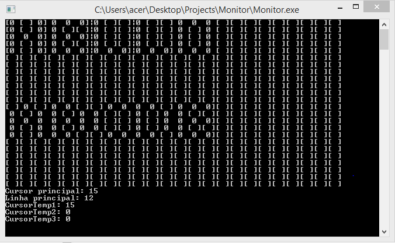

# Simulador de monitor

Algoritmo desenvolvido no 3º semestre do curso de Ciência da Computação para a disciplina de Sistemas Operacionais ministrada pelo professor <a href="https://www.linkedin.com/in/erwin-alexander-uhlmann-7294381b/">Erwin Alexander Uhlmann</a>.

## Funcionamento:

Este algoritmo simula o funcionamento de um monitor 24x24, onde cada "[ ]" é um pixel, e estes podem ser "acesos", virando "|0|", desenhando as letras na tela.

Cada letra desenhada, ocupa um espaço de 3x5 pixels (largura x altura), sendo possível escrever 4 linhas com 8 letras, já que a cada quebra de linha, é pulada uma linha de 24x1 pixels (largura x altura).

Apenas foram feitas as letras "A", "B", "C", "D", "E", "L", "H" e "O".

Ao pressionar as teclas, é chamada a função correspondente que "acende" os pixels para formar o desenho da letra.

Ao teclar Enter faz uma quebra de linha e o cursor passa para a linha de baixo, descendo 6 pixels de altura.

Pressionando a tecla Backspace, apaga a última letra digitada.

### Exemplo:

<figure>
	
	<figcaption>Figura 1 - Imprimindo "HELLO" e "ABCD"</figcaption>
</figure>

